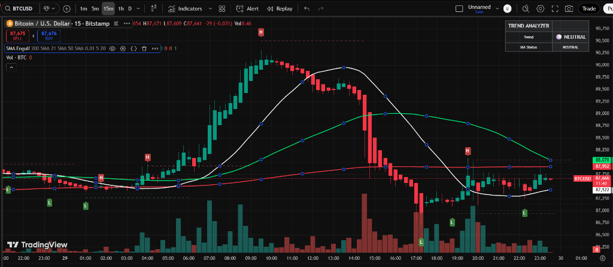

# Pine Script Trading Indicator

A comprehensive TradingView Pine Script indicator combining Moving Averages, Engulfing Patterns, Swing Points detection, and Trend Analysis.

## Features

### 📈 Moving Averages
- **3 Customizable MAs** - Choose from SMA, EMA, WMA, or HMA
- **Flexible Periods** - Default: 9, 21, 50 (customizable)
- **Custom Colors** - Personalize each MA line

### 🕯️ Engulfing Pattern Detection
- **Bullish Engulfing** - Green ▲ marker below candle
- **Bearish Engulfing** - Red ▼ marker above candle
- **Configurable Min Body Size** - Filter out weak patterns

### 📍 Swing Highs & Lows
- **Automatic Detection** - Identifies pivot points
- **Visual Markers** - "H" for highs, "L" for lows
- **Horizontal Lines** - Dashed lines at support/resistance levels
- **Smart Management** - Shows last 10 levels, auto-cleans old lines

### 📊 Trend Analyzer
- **Live Trend Table** - Shows current market trend (Bullish/Bearish/Neutral)
- **MA Alignment Status** - Quick trend confirmation
- **Color-Coded** - Green (bullish), Red (bearish), Gray (neutral)

### 🔔 Alerts
- Bullish/Bearish Engulfing patterns
- Price crossing above/below fast MA
- Customizable notifications

## Installation

1. Open TradingView
2. Click on **"Pine Editor"** at the bottom
3. Copy the code from `all_in_one_indicator.pine`
4. Paste it into the editor
5. Click **"Add to Chart"**

## Settings

### Moving Averages Group
- Enable/disable each MA
- Adjust periods (default: 9, 21, 50)
- Choose MA type (SMA/EMA/WMA/HMA)
- Customize colors

### Engulfing Group
- Toggle pattern detection on/off
- Set minimum body size percentage

### Swing Points Group
- Adjust detection length (default: 5)
- Toggle highs/lows display
- Toggle horizontal lines
- Set line extension length

## Usage Tips

1. **Trend Following**: Use MA alignment + trend analyzer for direction
2. **Entry Points**: Look for engulfing patterns at swing lows/highs
3. **Support/Resistance**: Horizontal lines mark key levels
4. **Confirmation**: Combine multiple signals for higher probability trades

## Screenshots

*Full indicator display with all features enabled*

## Version

- **Pine Script Version**: v5
- **Compatible with**: TradingView (all plans)

## Author

Created for efficient technical analysis and trend identification.

## License

MIT License - Free to use and modify

## Contributing

Feel free to fork and submit pull requests for improvements!

## Changelog

### v1.0.0 (2025-01-29)
- Initial release
- Moving Averages (SMA/EMA/WMA/HMA)
- Engulfing pattern detection
- Swing highs/lows with horizontal lines
- Trend analyzer table
- Alert conditions
